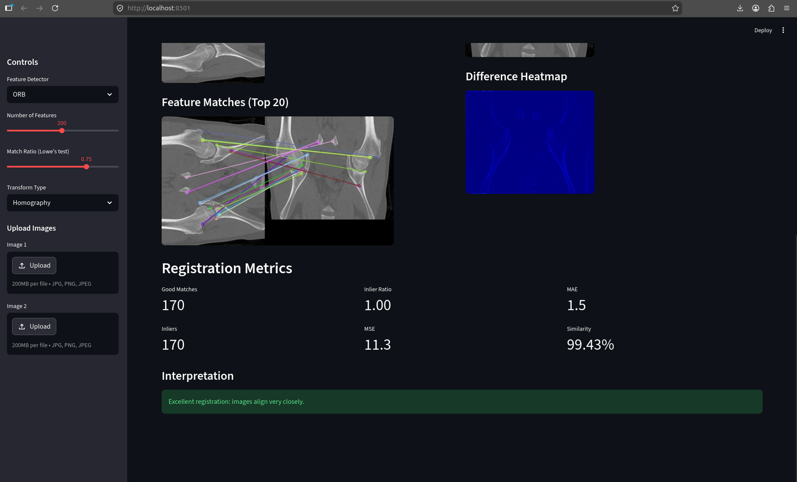
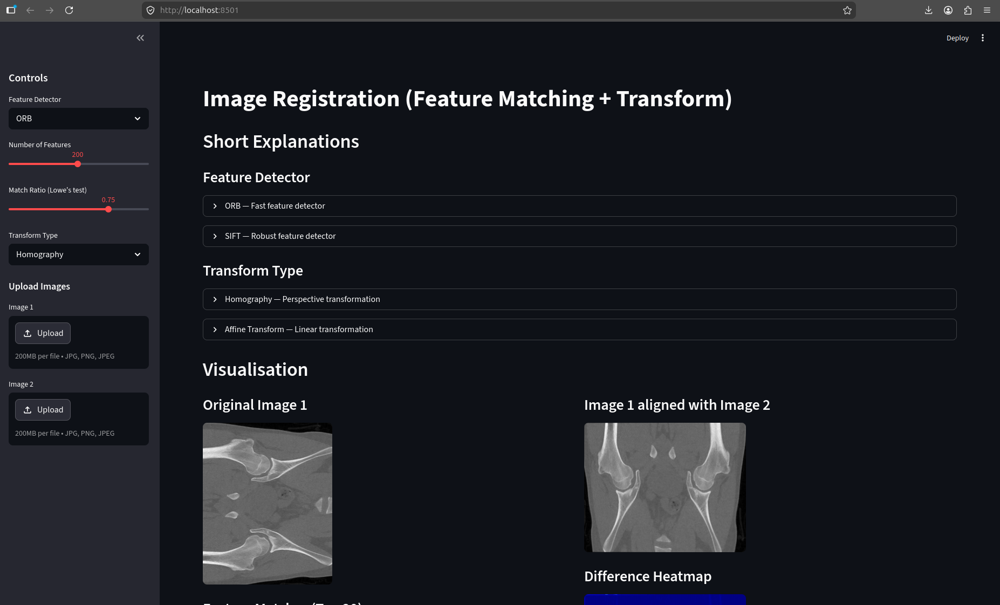

# Image Registration App

A Streamlit application for image registration using feature detection, feature matching, and geometric transformations.

The app detects key features in two images and transforms **Image 1** so that it aligns with **Image 2**. It also provides visualizations and metrics to evaluate registration quality.

---

## Features

### Feature Detection
Currently implemented:

- **ORB (Oriented FAST and Rotated BRIEF)**
  - Fast and lightweight
  - Suitable for real-time applications
  - Rotation invariant

- **SIFT (Scale-Invariant Feature Transform)**
  - More robust feature detection
  - Handles scale and rotation changes
  - Better for difficult image matching tasks

### Transformation Methods

- **Homography**
  - Models perspective transformations
  - Suitable for images taken from different viewpoints

- **Affine Transform**
  - Models translation, rotation, scaling, and shearing
  - Preserves straight lines and parallel structures

### Visualization

The application provides:

- Original image display
- Aligned image display
- Feature match visualization
- Difference heatmap
- Registration quality metrics

### Metrics

Current metrics include:

- Number of good feature matches
- Number of inliers
- Inlier ratio
- Alignment quality measurements


---

## Installation

Clone the repository:

```bash
git clone git@github.com:mh-hmm/Image_Analysis_Assignment2.git
cd Image_Analysis_Assignment2
```

Install dependencies:

```bash
python -m pip install -r requirements.txt
```

---

## Run Locally

Start the Streamlit application:

```bash
streamlit run app.py
```

The application should automatically open in your default web browser.

---

## How to Use

1. Upload two images using the sidebar.
   - Image 1 → source image
   - Image 2 → target image

2. Select:
   - Feature detector:
     - ORB
     - SIFT

3. Adjust parameters:
   - Number of features
   - Match ratio threshold

4. Select transformation method:
   - Homography
   - Affine Transform

5. View results:
   - Aligned image
   - Feature matches
   - Difference heatmap
   - Registration metrics

If no images are uploaded, sample images are loaded automatically.

---

## Screenshot

When running correctly, the application should appear similar to:



---

## Hugging Face Deployment

Application URL:

```text
https://huggingface.co/spaces/aahh-ha/Image_Registration
```

---

## Known Limitations

- Registration quality depends heavily on image similarity.
- Low-texture images may not provide enough feature points.
- Large illumination changes can reduce matching quality.
- ORB is faster but may struggle with difficult transformations.
- SIFT is more robust but computationally slower.
- Affine transformations cannot model perspective distortion.
- Homography assumes a planar relationship between images.
- Incorrect feature matches can lead to poor alignment results.
